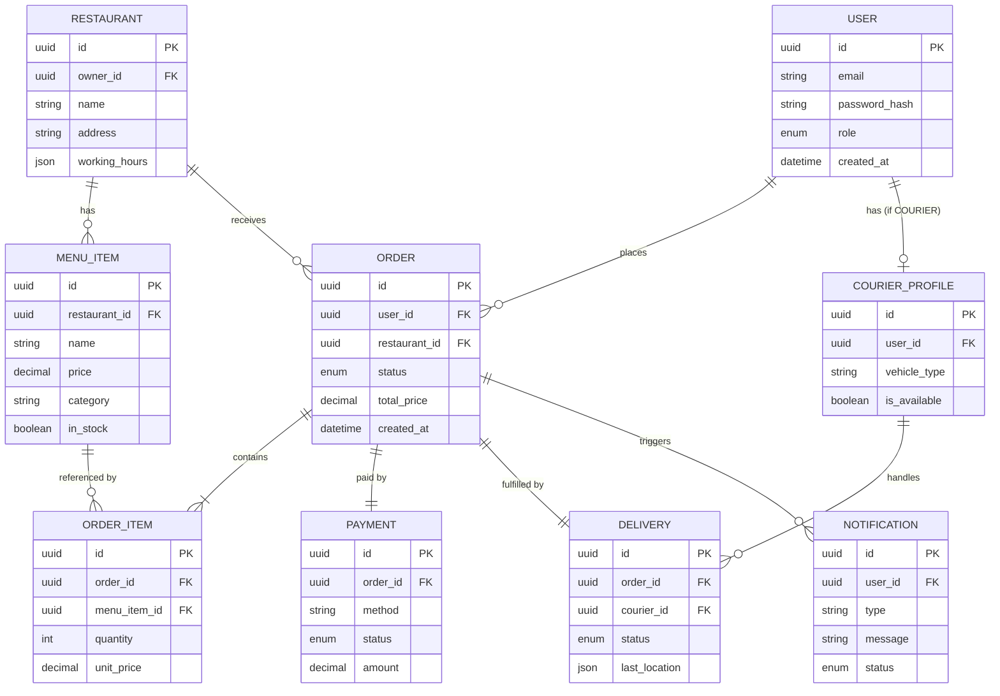
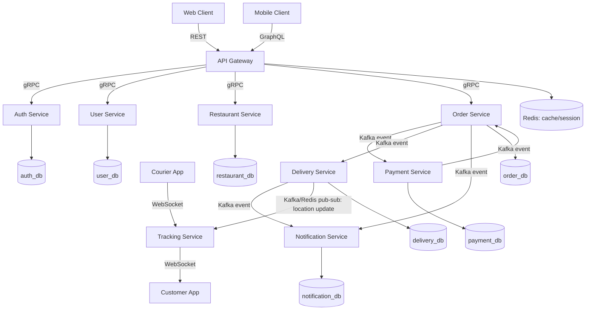

# 🍔 Tıklaye — Yemeksepeti Tarzı Backend Projesi

Mikroservis mimarisiyle geliştirilen, Web (REST) ve Mobile (GraphQL) client'ları
destekleyen, gerçek zamanlı kurye takibi olan bir yemek sipariş platformu.
 
---

## İçindekiler
1. [Proje Özeti](#1-proje-özeti)
2. [Kullanıcı Rolleri](#2-kullanıcı-rolleri-persona)
3. [Kullanıcı Senaryoları](#3-kullanıcı-senaryoları-use-case)
4. [İş Kuralları](#4-iş-kuralları)
5. [Fonksiyonel Gereksinimler](#5-fonksiyonel-gereksinimler)
6. [Fonksiyonel Olmayan Gereksinimler](#6-fonksiyonel-olmayan-gereksinimler)
7. [ER Diyagramı](#7-er-diyagramı)
8. [Sistem Mimarisi](#8-sistem-mimarisi)
9. [API Taslağı](#9-yüksek-seviye-api-taslağı)
10. [Yol Haritası](#10-yol-haritası)
---

## 1. Proje Özeti
Yemeksepeti tarzı, mikroservis mimarisiyle geliştirilen bir yemek sipariş platformu.
Web (REST) ve Mobile (GraphQL) client'ları bir **API Gateway** üzerinden mikroservislere
ulaşır; servisler arası senkron iletişim **gRPC**, asenkron iletişim **Kafka** ile sağlanır.
Kurye konum takibi **WebSocket** üzerinden gerçek zamanlı yapılır. Her servis kendi
veritabanına sahiptir (Database-per-Service).

**Stack:** Java 17 · Spring Boot 4.1.1 · Maven (multi-module) · Spring Data JPA ·
Flyway · PostgreSQL (database-per-service) · Kafka · Redis

**Servisler:** `auth-service` · `user-service` · `restaurant-service` · `order-service` ·
`payment-service` · `delivery-service` · `notification-service` · `tracking-service`
 
---

## 2. Kullanıcı Rolleri (Persona)

| Rol | Açıklama |
|---|---|
| `CUSTOMER` | Sipariş veren son kullanıcı |
| `RESTAURANT_OWNER` | Restoran/menü yöneten kullanıcı |
| `COURIER` | Teslimat yapan kurye |
| `ADMIN` | Platform yöneticisi |
 
---

## 3. Kullanıcı Senaryoları (Use Case)

- Müşteri kayıt olur / giriş yapar (JWT access + refresh token)
- Müşteri restoranları ve menüleri listeler, filtreler
- Müşteri sepete ürün ekler, sipariş oluşturur
- Sipariş oluşturulunca ödeme alınır (sanal POS / cüzdan)
- Ödeme başarılıysa sipariş restorana düşer, restoran onaylar/reddeder
- Kurye ataması yapılır, kurye siparişi teslim alır
- Kurye konumu WebSocket üzerinden Tracking servisine, oradan müşteriye akar
- Sipariş durum değişikliklerinde push / SMS / email bildirimi gider
- Müşteri siparişi iptal/iade talep edebilir (durum kurallarına bağlı)
- Restoran sahibi menü / stok / çalışma saatlerini yönetir
- Admin kullanıcı, restoran ve şikayetleri yönetir
---

## 4. İş Kuralları

> Aşağıdaki kurallar ilk taslak — geliştirme sırasında detaylandırılacak.

- Sipariş akışı: `PENDING → CONFIRMED → PREPARING → ON_THE_WAY → DELIVERED`
  Geri adım yok; sadece `CANCELLED` / `REFUNDED` istisna dallanması var
- Ödeme onaylanmadan sipariş restorana düşmez
- Kurye ataması, sipariş `CONFIRMED` durumuna geçince tetiklenir
- Restoran kapalıyken (çalışma saati dışı) yeni sipariş alınamaz
- İade: teslimat başlamadan önce tam iade; başladıktan sonra kısmi/duruma bağlı
---

## 5. Fonksiyonel Gereksinimler

- **Auth:** kayıt, giriş, token yenileme, rol bazlı yetkilendirme
- **Restoran/Menü:** CRUD, stok & çalışma saati yönetimi
- **Sipariş:** oluşturma, durum takibi, iptal/iade
- **Ödeme:** sanal POS/cüzdan işleme, 3D Secure
- **Teslimat:** kurye atama, konum takibi (WebSocket), rota optimizasyonu (ileri faz)
- **Bildirim:** push / SMS / email / in-app
---

## 6. Fonksiyonel Olmayan Gereksinimler

- Database-per-Service — her mikroservis kendi veritabanına sahip
- Event-driven, gevşek bağlı (loose coupling) servisler — Kafka
- Correlation ID ile uçtan uca izlenebilirlik (distributed tracing)
- Health check + circuit breaker ile dayanıklılık (resilience)
- Prometheus/Grafana ile metrik, ELK ile merkezi log
- Yüksek test coverage hedefi (unit + integration + API + load testleri)
---

## 7. ER Diyagramı

> Mantıksal / domain genelinde model — fiziksel olarak Database-per-Service ile bölünecek.

 
---

## 8. Sistem Mimarisi

 
---

## 9. Yüksek Seviye API Taslağı

> Detaylar servis bazlı ilerledikçe ayrıca dokümante edilecek (Swagger/OpenAPI).

| Method | Endpoint | Açıklama |
|---|---|---|
| POST | `/auth/register` | Kayıt |
| POST | `/auth/login` | Giriş |
| POST | `/auth/refresh` | Token yenileme |
| GET | `/restaurants` | Restoran listesi |
| GET | `/restaurants/:id/menu` | Menü |
| POST | `/orders` | Sipariş oluşturma |
| GET | `/orders/:id` | Sipariş detay |
| PATCH | `/orders/:id/status` | Durum güncelleme |
| POST | `/payments` | Ödeme başlatma |
| GET | `/payments/:orderId` | Ödeme durumu |
| GET | `/deliveries/:orderId/location` | Kurye konumu (+ WS kanalı) |

GraphQL: mobil ekranlar için birleşik sorgular (örn. sipariş + restoran + kurye
konumu tek istekte).
 
---

## 10. Yol Haritası

- [x] Git/Branch stratejisi (main/develop)
- [x] Parent pom.xml (Maven multi-module yapı)
- [ ] Ortak/shared altyapı (correlation ID, health check, logging, monitoring)
- [ ] Auth Service (JWT, Spring Security, argon2/bcrypt)
- [ ] User Service
- [ ] Restaurant Service
- [ ] Order Service
- [ ] Payment / Delivery / Notification Service
- [ ] Tracking Service (WebSocket, Delivery'den Kafka/Redis ile beslenir)
- [ ] API Gateway (REST + GraphQL)
